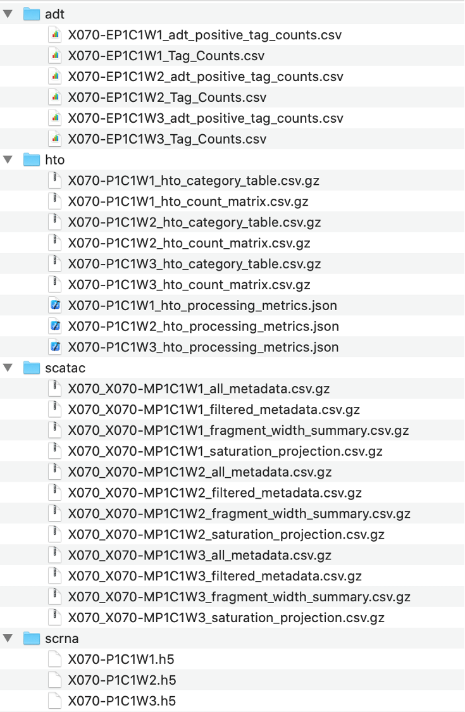

# batchreporter

R functions and scripts for summarizing and performing batch-level QC on AIFI sequencing pipeline data.  

<a id="contents"></a>

## Contents

#### [Dependencies](#depends)

#### [Installation](#installation)

#### [Available Reports](#available_report)

#### [Running Reports](#batch_report)

#### [scRNA Cell Hashing Batch Report](#scrna_batch_report)
- [Parameters](#scrna_report_param)
- [Sample Sheet Guidelines](#scrna_sample_sheet)
- [Outputs](#scrna_report_out)
- [Tests](#scrna_report_test)

#### [NGS Batch Report](#ngs_batch_report)
- [Parameters](#ngs_report_param)
- [Sample Sheet Guidelines](#ngs_sample_sheet)
- [Outputs](#ngs_report_out)
- [Tests](#ngs_report_test)  

#### [Version History](#version_history)

#### [Legal](#legal_info)
- [License](#license)
- [Level of Support](#support)
- [Contribution](#contrib)

<a id="depends"></a>

## Dependencies    

This repository requires that `pandoc` and `libhdf5-devel` libraries are installed as dependencies of the `H5weaver` functions:
```
sudo apt-get install pandoc libhdf5-dev
```

It also depends on the internal AIFI `H5weaver` and `HTOparser` packages. Additional CRAN packages needed to run reports can be found in the `Description` file.

CRAN packages can be installed in R using:
```
# Example
install.packages("jsonlite")
install.packages("rmarkdown")
install.packages("optparse")
```

`H5weaver`, `HTOparser`, and `ATAComb` are internally developed packages found in the aifimmunology Github repositories.
```
devtools::install_github("aifimmunology/H5weaver")
devtools::install_github("aifimmunology/HTOparser")
devtools::install_github("aifimmunology/ATAComb")
```

[Return to Contents](#contents)

<a id="installation"></a>

## Installation
`batchreporter` is an R package with associated executable scripts. First install dependencies. Then install the R package from the AIFImmunology Github repository:

```
Sys.setenv(GITHUB_PAT = "[your_PAT_here]")
devtools::install_github("aifimmunology/batchreporter")
```  
To run scripts, clone the GitHub repository and run the desired wrapper script within the local clone.

[Return to Contents](#contents)  

<a id="available_report"></a>

## Available Reports and Scripts 
Available batch reports are as follows:
- [scRNA cell hashing batch report](#scrna_batch_report): Batch report for stand alone scRNA Cell-Hashing + labeling pipelines, run post-labeling  
- [NGS batch report](#ngs_batch_report): Batch QC report intended to summarize data quality for pipeline "approval" steps. Can be used to summarize multiome data in a single report for any combination of supported single cell modalities.  Run on well-level data after initial processing steps.  

[Return to Contents](#contents)  

<a id="batch_report"></a>

## Running Batch Reports  
Batch reports are run by executing an R wrapper script with the appropriate options. Options may be unique to different report types. The wrapper script will feed
supplied parameters to the Rmarkdown document to render a new report, output to locations specified by arguments.  
 
[Return to Contents](#contents)  

<a id="scrna_batch_report"></a>

## scRNA Cell Hashing Batch Report

The `run-scrna-batch-qc.R` wrapper script renders `scrna-batch-report-parent.Rmd` and is compatible with results files generated by [`cell-hashing-pipeline`](https://github.com/aifimmunology/cell-hashing-pipeline) and [`cell-labeling-pipeline`](https://github.com/aifimmunology/cell-labeling-pipeline). Output files from both processes are required for processing. This top level "parent" document will utilize "child" rmarkdown reports that reside within `batchreporter`  

[Return to Contents](#contents)  

<a id="scrna_report_param"></a>

#### Input Parameters

There are 9 parameters for this script:  

* `-b or --batch_id`:  The batch name, ie B001
* `-i or --in_dir`: The input directory containing the files to process. Should include the following subdirectories:  
  * `labeled_h5`: Contains all sample labeled.h5 files for the batch generated by [`cell-labeling-pipeline`](https://github.com/aifimmunology/cell-labeling-pipeline)  
  * `multiplet_h5`: Contains all pool multiplet.h5 files for the batch generated by `run_h5_merge_by_hash.R` from [`cell-hashing-pipeline`](https://github.com/aifimmunology/cell-hashing-pipeline)  
  * `hash`: Contains all well hto_processing_metrics .json files for the batch generated by `run_hto_processing.R` from [`cell-hashing-pipeline`](https://github.com/aifimmunology/cell-hashing-pipeline)  
  * `control`: Contains all batch control labeled.h5 files generated by [`cell-labeling-pipeline`](https://github.com/aifimmunology/cell-labeling-pipeline) for a standing set of reference batches. Included reference batches may be added to over time, but initially include B004, B007, and B025.
* `-k or --in_key`: A 6-column .csv Sample Sheet (see format [below](#scrna_sample_sheet)) of identifiers for all samples in the batch.
* `-c or --in_config`: A .csv file of analysis parameters. For standard pbmc processing with Seurat 3 labeling may use the default config. If not supplied, will default to the standing example file within `batchreporter` ('default_rna_config_v1.csv')
* `-t or --in_batch_meta`: A .json file of key value pairs describing relevant reference datasets and software versions used in the analysis pipeline processing of the batch. If provided, all values will be echoed as a flat table on report. 
* `-n or --n_cores`: An integer value of number of cores to use for multithreaded processes, used by Seurat functions  
* `-m or --mc_mb_limit`: An integer value of number of maximum size in Mb allowed for exporting globals to each worker in multicore processing (for futures R package). Defaults to 50000, suggest >= 20000.  
* `-d or --out_dir`: A directory path to use to output the batch report.
* `-o or --out_html`: A filename to use to output the HTML summary report file. For example "B001_scRNA_batch_report.html"

Test runs may be performed by supplying only the -b and -o arguments, as seen in test [below](#batch_report_test). 

[Return to Contents](#contents)  

<a id="scrna_sample_sheet"></a>

##### Sample Sheet Format

`run-scrna-batch-qc.R` requires a **Sample Sheet**, provided as the -k parameter, which has 6 comma-separated columns: SampleID, Type, BatchID, HashTag, PoolID, and WellID. `Type` is either `Sample` for normal samples or `Control` for bridging controls. 
All wells associated with each sample should be collapsed into a ";"-delimited string. Expected formatting for variables can be seen below. 

For example:
```
SampleID,Type,BatchID,HashTag,PoolID,WellID
PB5206W2,Sample,B001,HT1,B001-P1,B001-P1C1W1;B001-P1C1W2;B001-P1C1W3;B001-P1C1W4;B001-P1C1W5;B001-P1C1W6;B001-P1C1W7;B001-P1C1W8;B001-P1C2W1;B001-P1C2W2;B001-P1C2W3;B001-P1C2W4;B001-P1C2W5
PB5206W3,Sample,B001,HT2,B001-P1,B001-P1C1W1;B001-P1C1W2;B001-P1C1W3;B001-P1C1W4;B001-P1C1W5;B001-P1C1W6;B001-P1C1W7;B001-P1C1W8;B001-P1C2W1;B001-P1C2W2;B001-P1C2W3;B001-P1C2W4;B001-P1C2W5
PB5206W4,Sample,B001,HT3,B001-P1,B001-P1C1W1;B001-P1C1W2;B001-P1C1W3;B001-P1C1W4;B001-P1C1W5;B001-P1C1W6;B001-P1C1W7;B001-P1C1W8;B001-P1C2W1;B001-P1C2W2;B001-P1C2W3;B001-P1C2W4;B001-P1C2W5
PB5206W5,Sample,B001,HT4,B001-P1,B001-P1C1W1;B001-P1C1W2;B001-P1C1W3;B001-P1C1W4;B001-P1C1W5;B001-P1C1W6;B001-P1C1W7;B001-P1C1W8;B001-P1C2W1;B001-P1C2W2;B001-P1C2W3;B001-P1C2W4;B001-P1C2W5
PB5206W6,Sample,B001,HT5,B001-P1,B001-P1C1W1;B001-P1C1W2;B001-P1C1W3;B001-P1C1W4;B001-P1C1W5;B001-P1C1W6;B001-P1C1W7;B001-P1C1W8;B001-P1C2W1;B001-P1C2W2;B001-P1C2W3;B001-P1C2W4;B001-P1C2W5
PB5206W7,Sample,B001,HT6,B001-P1,B001-P1C1W1;B001-P1C1W2;B001-P1C1W3;B001-P1C1W4;B001-P1C1W5;B001-P1C1W6;B001-P1C1W7;B001-P1C1W8;B001-P1C2W1;B001-P1C2W2;B001-P1C2W3;B001-P1C2W4;B001-P1C2W5
PB7626W2,Sample,B001,HT7,B001-P1,B001-P1C1W1;B001-P1C1W2;B001-P1C1W3;B001-P1C1W4;B001-P1C1W5;B001-P1C1W6;B001-P1C1W7;B001-P1C1W8;B001-P1C2W1;B001-P1C2W2;B001-P1C2W3;B001-P1C2W4;B001-P1C2W5
PB7626W3,Sample,B001,HT8,B001-P1,B001-P1C1W1;B001-P1C1W2;B001-P1C1W3;B001-P1C1W4;B001-P1C1W5;B001-P1C1W6;B001-P1C1W7;B001-P1C1W8;B001-P1C2W1;B001-P1C2W2;B001-P1C2W3;B001-P1C2W4;B001-P1C2W5
PB7626W4,Sample,B001,HT9,B001-P1,B001-P1C1W1;B001-P1C1W2;B001-P1C1W3;B001-P1C1W4;B001-P1C1W5;B001-P1C1W6;B001-P1C1W7;B001-P1C1W8;B001-P1C2W1;B001-P1C2W2;B001-P1C2W3;B001-P1C2W4;B001-P1C2W5
PB7626W5,Sample,B001,HT10,B001-P1,B001-P1C1W1;B001-P1C1W2;B001-P1C1W3;B001-P1C1W4;B001-P1C1W5;B001-P1C1W6;B001-P1C1W7;B001-P1C1W8;B001-P1C2W1;B001-P1C2W2;B001-P1C2W3;B001-P1C2W4;B001-P1C2W5
PB7626W6,Sample,B001,HT12,B001-P1,B001-P1C1W1;B001-P1C1W2;B001-P1C1W3;B001-P1C1W4;B001-P1C1W5;B001-P1C1W6;B001-P1C1W7;B001-P1C1W8;B001-P1C2W1;B001-P1C2W2;B001-P1C2W3;B001-P1C2W4;B001-P1C2W5
PB7626W7,Sample,B001,HT13,B001-P1,B001-P1C1W1;B001-P1C1W2;B001-P1C1W3;B001-P1C1W4;B001-P1C1W5;B001-P1C1W6;B001-P1C1W7;B001-P1C1W8;B001-P1C2W1;B001-P1C2W2;B001-P1C2W3;B001-P1C2W4;B001-P1C2W5
IMM19-711,Control,B001,HT14,B001-P1,B001-P1C1W1;B001-P1C1W2;B001-P1C1W3;B001-P1C1W4;B001-P1C1W5;B001-P1C1W6;B001-P1C1W7;B001-P1C1W8;B001-P1C2W1;B001-P1C2W2;B001-P1C2W3;B001-P1C2W4;B001-P1C2W5
```

Sample sheets should be provided for each dataset. When running script without a **Sample Sheet**, for testing purposes, the -k parameter is omitted and the script uses an example file provided in `batchreporter`.  

An example run:
```
git clone https://github.com/aifimmunology/scrna-batch-qc.git

Rscript --vanilla \
    /home/jupyter/scrna-batch-report/run-scrna-batch-qc.R \
    -b B026  \
    -i /home/jupyter/test_data/B026 \
    -k /home/jupyter/test_data/B026/sample_key_B026.csv   \
    -c /home/jupyter/local.lib/batchreporter/extdata/default_rna_config_v1.csv  \
    -d /home/jupyter/test_output/ \
    -o  B026_20210317.html \
    -t  /home/jupyter/local.lib/batchreporter/extdata/batch-metadata.json \
    -n 14 \
    -m 20000 \
    2>&1 | tee /home/jupyter/test_output/B026_20210317-1_log.txt
```

[Return to Contents](#contents)

<a id="scrna_report_out"></a>

#### Output Files

`run-scrna-batch-qc.R` will generate the HTML reporting file with name as defined by inut parameter -o. 

For example, using the run above, we would get the following outputs in out_dir:
```
B026_20210317.html
```

[Return to Contents](#contents)

<a id="scrna_report_test"></a>

#### Tests

Test runs can be performed using datasets provided with the `batchreporter` package using `-b X002`. These require only the `-t` and `-o` parameters.

```
Rscript --vanilla \
    /home/jupyter/batchreporter/run-scrna-batch-qc.R \
    -b X002  \
    -o /home/jupyter/test_output \

```

[Return to Contents](#contents)

<a id="ngs_batch_report"></a>

## NGS Batch Report

The `run-ngs-batch-qc.R` wrapper script renders `ngs-batch-report.Rmd` to create a multimodal batch QC report (html). 
It is compatible with results files generated by [`cell-hashing-pipeline`](https://github.com/aifimmunology/cell-hashing-pipeline), [`tenx-rnaseq-pipeline`](https://github.com/aifimmunology/tenx-rnaseq-pipeline), and [`tenx-atacseq-pipeline`](https://github.com/aifimmunology/tenx-atacseq-pipeline). 
The same script can be called with different input parameters to generate reports 
for various modality combinations. This top level "parent" document will utilize 
"child" rmarkdown reports that reside within `batchreporter`. 

[Return to Contents](#contents)  

<a id="ngs_report_param"></a>

#### Input Parameters

There are 8 parameters for this script:  

* `-b or --batch_id`:  The batch name, ie B001
* `-m or --in_method`:  A ";"-delimited string of the data streams being 
processed enclosed in quotes, for example "hto;scrna;scatac;adt" for a hashed 
TEA-seq run, or "scrna;adt" for a non-hased CITE-seq run. The currently supported 
data stream names are as follows:
  * `scrna` (single cell RNA)
  * `scatac` (single cell ATAC)
  * `adt` (antibody derived tags)
  * `hto` (hashtag oligos, if the run is hashed)
* `-i or --in_dir`: The input directory containing all results files to process. Must 
include one subdirectory per modality named in `in_method` above. An example file
tree can be seen in the image [below](#ngs_example_directory),  but the required files 
per subdirectory are as follows:  
  * `hto`: Contains the following well level files generated by `run_hto_processing.R` 
  from [`cell-hashing-pipeline`](https://github.com/aifimmunology/cell-hashing-pipeline)
    * `hto_processing_metrics.json`, one file per well
    * `hto_category_table.csv.gz`, one file per well
    * `hto_count_matrix.csv.gz`, one file per well
  * `scrna`: Contains the following well level files generated by `add-add-tenx-metadata.R` 
  from [`tenx-rnaseq-pipeline`](https://github.com/aifimmunology/tenx-rnaseq-pipeline)  
    * `.h5`, one file per well.The metadata-injected h5 files, for example `B001-P1C1W1.h5` etc.  
  * `scatac`: Contains the following well level files generated by `02_run_crossplatform_atac_qc.R` 
  from [`tenx-atacseq-pipeline`](https://github.com/aifimmunology/tenx-atacseq-pipeline)   
    * `all_metadata.csv.gz`, one file per well. Metadata for all cell barcodes.
    * `filtered_metadata.csv.gz`, one file per well. Metadata for all cell barcodes passing ATAC QC filters.
    * `fragment_width_summary.csv.gz`, one file per well. Fragment width count summary.
    * `saturation_projection.csv.gz`, one file per well. Fragment saturation curve projections.
  * `adt`: Contains the following well level files generated by 
  [`BarCounter`](https://github.com/aifimmunology/BarCounter) or `run_adt_well_qc.R` 
  from [`tenx-rnaseq-pipeline`](https://github.com/aifimmunology/tenx-rnaseq-pipeline)  
    * `Tag_Counts.csv` (BarCounter output). ADT counts for all cell barcodes, unfiltered.  
    * `adt_positive_tag_counts.csv` (run_adt_well_qc.R output). ADT counts for cell 
    barcodes associated with positive cell calls.
* `-k or --in_key`: A 6-column .csv Sample Sheet (see format [below](#ngs_sample_sheet)) 
of identifiers for all samples in the batch.
* `-c or --in_config`: A .csv file of analysis parameters. For standard pbmc 
processing with Seurat 3 labeling may use the default config. If not supplied, 
will default to the standing example file within `batchreporter` (see [default_rna_config_v1.csv](https://github.com/aifimmunology/batchreporter/blob/master/inst/extdata/default_rna_config_v1.csv)). 
Currently used for scRNA and HTO analysis, but can include analysis parameters 
for other datastreams in the future.
* `-t or --in_batch_meta`: A .json file of key value pairs describing relevant 
reference datasets and software versions used in the analysis pipeline processing 
of the batch. If provided, all values will be echoed as a flat table on report. 
* `-d or --out_dir`: A directory path to use to output the batch report.
* `-o or --out_html`: A filename to use to output the HTML summary report file. 
For example "B001_scRNA_batch_report.html"

Test runs may be performed by supplying only the -b and -o arguments, as seen in
test [below](#ngs_report_test). 

<a id="ngs_example_directory"></a>
Here is an example of the input directory structure with subdirectories for a 
hashed TEA-seq run:  



[Return to Contents](#contents)  

<a id="ngs_sample_sheet"></a>

##### Sample Sheet Format

`run-ngs-batch-qc.R` requires a **Sample Sheet**, provided as the -k parameter, which has 6 comma-separated columns: SampleID, Type, BatchID, HashTag, PoolID, and WellID. `Type` is either `Sample` for normal samples or `Control` for bridging controls. When processing a non-hashed run, the HashTag column values will be 'NA'. All wells associated with each sample should be collapsed into a ";"-delimited string for hased runs. Expected formatting for variables can be seen below. 

For example a hashed run may look like this:
```
SampleID,Type,BatchID,HashTag,PoolID,WellID
PB1051W10,Sample,X070,HT1,X070-P1,X070-P1C1W1;X070-P1C1W2;X070-P1C1W3
PB1178W10,Sample,X070,HT2,X070-P1,X070-P1C1W1;X070-P1C1W2;X070-P1C1W3
PB1194W10,Sample,X070,HT3,X070-P1,X070-P1C1W1;X070-P1C1W2;X070-P1C1W3
PB2216W10,Sample,X070,HT4,X070-P1,X070-P1C1W1;X070-P1C1W2;X070-P1C1W3
PB5206W10,Sample,X070,HT5,X070-P1,X070-P1C1W1;X070-P1C1W2;X070-P1C1W3
PB7626W10,Sample,X070,HT7,X070-P1,X070-P1C1W1;X070-P1C1W2;X070-P1C1W3
```  
and a non-hashed run may look like this:  
```
SampleID,Type,BatchID,HashTag,PoolID,WellID
Sample01,Sample,X000,NA,X000-P1,X000-P1C1W1
Sample02,Sample,X000,NA,X000-P1,X000-P1C1W2
Sample03,Sample,X000,NA,X000-P1,X000-P1C1W3
```  

Sample sheets should be provided for each dataset. When running script without a **Sample Sheet**, for testing purposes, the -k parameter may be omitted and the script uses an example file provided in `batchreporter` (`example_sample_key_X070.csv`).  

An example run:
```
git clone https://github.com/aifimmunology/scrna-batch-qc.git

Rscript --vanilla \
    /home/jupyter/batchreporter/run-ngs-batch-qc.R \
    -b X070  \
    -m 'hto;scrna;scatac;adt' \
    -i /home/jupyter/test_data/X070 \
    -k /home/jupyter/test_data/X070/sample_key_X070.csv   \
    -c /home/jupyter/local.lib/batchreporter/extdata/default_rna_config_v1.csv  \
    -d /home/jupyter/test_output/ \
    -o  X070_ngs_batch_report.html \
    -t  /home/jupyter/local.lib/batchreporter/extdata/batch-metadata.json \
    2>&1 | tee /home/jupyter/test_output/X070_ngs-batch-report_log.txt
```

[Return to Contents](#contents)

<a id="ngs_report_out"></a>

#### Output Files

`run-ngs-batch-qc.R` will generate the HTML reporting file with name as defined by inut parameter -o. In addition the

For example, using the example TEA run above, we would get the following outputs in out_dir:
```
 X070_ngs_batch_report.html
 X070_atac_batch_qc_metrics.json
 X070_atac_hashed_batch_qc_metrics.json
```

[Return to Contents](#contents)

<a id="ngs_report_test"></a>

#### Tests

Test runs can be performed using datasets provided with the `batchreporter` package using `-b X070`. These require only the `-t`,`-d`, and `-o` parameters.

##### Hashed TEA-seq Example
The default test is a hashed TEA-seq run of experimental batch X070, which consists of 6 samples run across 3 wells.
```
Rscript --vanilla \
    /home/jupyter/batchreporter/run-ngs-batch-qc.R \
    -b X070  \
    -d /home/jupyter/testoutput  \
    -o X070_ngs_batch_report_testoutput-hashedTEAseq.html \
    2>&1 | tee /home/jupyter/test_output/X070_ngs-batch-report_test-hash_log.txt
```  
An example output report generated by this code is located in the example output folder [here](inst/example_output/X070_ngs_batch_report_testoutput-hashedTEAseq.html)

##### Non-Hashed TEA-seq Example  
A non-hashed tea-seq example can be generated from the same X070 data using the following input parameters.

```
Rscript --vanilla \
    /home/jupyter/batchreporter/run-ngs-batch-qc.R \
    -b X000  \
    -m 'scrna;scatac;adt' \
    -i /home/jupyter/test_data/X070 \
    -k /home/jupyter/test_data/X070/sample_key_X070_dummy-nonhashed.csv   \
    -c /home/jupyter/local.lib/batchreporter/extdata/default_rna_config_v1.csv  \
    -d /home/jupyter/testoutput \
    -o  X000_ngs_batch_report_testoutput-simulatednonhashedTEAseq.html \
    2>&1 | tee /home/jupyter/test_output/X000_ngs-batch-report_test-nonhash_log.txt

```  
An example output report generated by this code is located in the example output folder [here](inst/example_output/X000_ngs_batch_report_testoutput-simulatednonhashedTEAseq.html)

[Return to Contents](#contents)

<a id="version_history"></a>

#### Version History  

|Version|Date|Description|
|--------|---------|------------------------------------------------|
|1.1.0|6/8/2021|Addition of NGS multimodal batch report|
|1.0.0 |          |Initial release, scRNA hashing pipeline batch report|  


[Return to Contents](#contents)


<a id="legal_info"></a>

# Legal Information

<a id="license"></a>

## License

The license for this package is available on Github in the file LICENSE.txt in this repository.

<a id="support"></a>

## Level of Support

We are not currently supporting this code, but simply releasing it to the community AS IS but are not able to provide any guarantees of support. The community is welcome to submit issues, but you should not expect an active response.

<a id="contrib"></a>

## Contribution Agreement

If you contribute code to this repository through pull requests or other mechanisms, you are subject to the Allen Institute Contribution Agreement, which is available in the file CONTRIBUTING.md in this repository.
